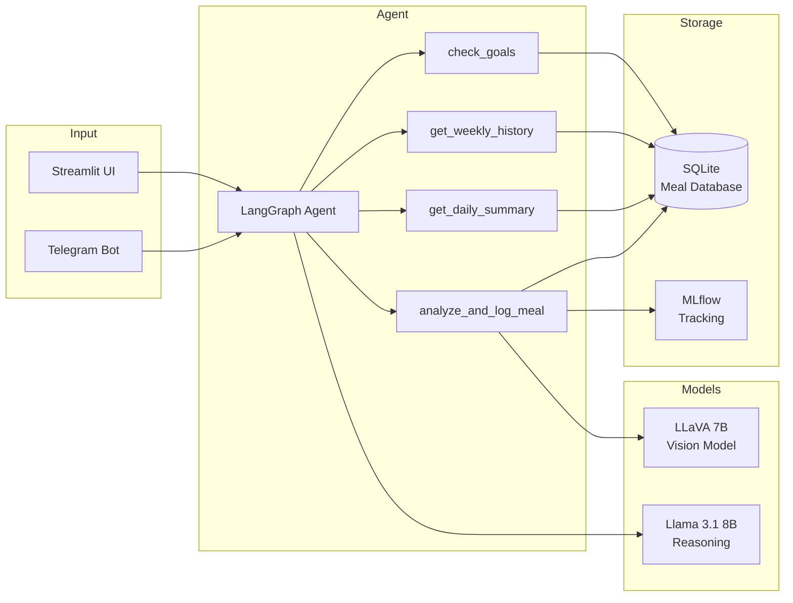

# 💪 FitAgent

AI-powered fitness and nutrition agent. Send a photo of your meal, get instant calorie tracking and personalized advice.

**100% local. 100% free. Multi-user. Telegram + Web.**

## Features

- 📷 **Meal photo analysis** — LLaVA vision model estimates calories and macros
- 🤖 **Agentic AI** — LangGraph agent decides which tools to use
- 📊 **Daily dashboard** — real-time calorie and macro tracking
- 📈 **Weekly trends** — Plotly charts showing progress over time
- 🎯 **Goal tracking** — personalized targets per user
- 💬 **Telegram bot** — track meals from your phone
- 🖥️ **Streamlit UI** — web dashboard with chat interface
- 👥 **Multi-user** — each user gets separate tracking
- 📉 **MLflow monitoring** — track model performance and latency
- 🐳 **Docker deployment** — one command to run everything

## Architecture


## Quick Start

### Option 1: Make (Recommended)
```bash
git clone https://github.com/sourav-modak/fit-agent.git
cd fit-agent
make setup
```

Then configure your environment:
```bash
cp .env.example .env
# Edit .env with your Telegram bot token
```

Run the app:
```bash
make run        # Streamlit UI at http://localhost:8501
make bot        # Telegram bot (in a separate terminal)
make track      # MLflow at http://localhost:5000 (in a separate terminal)
```

### Option 2: Docker (One Command)
```bash
git clone https://github.com/sourav-modak/fit-agent.git
cd fit-agent
cp .env.example .env
# Edit .env with your Telegram bot token

ollama serve                # Make sure Ollama is running
make docker-up              # Starts Streamlit + Bot + MLflow
```

Open:
- http://localhost:8501 — Streamlit UI
- http://localhost:5000 — MLflow Dashboard

### Option 3: Manual Setup
```bash
git clone https://github.com/sourav-modak/fit-agent.git
cd fit-agent
python -m venv .venv && source .venv/bin/activate
pip install -e ".[dev]"
ollama pull llava:7b
ollama pull llama3.1:8b
cp .env.example .env
# Edit .env with your Telegram bot token

streamlit run scripts/app.py
```

## Makefile Commands

| Command | What it does |
|---------|-------------|
| `make setup` | Create venv, install deps, pull Ollama models |
| `make run` | Launch Streamlit UI |
| `make bot` | Start Telegram bot |
| `make track` | Open MLflow dashboard |
| `make test` | Run pytest |
| `make docker-up` | Start all services in Docker |
| `make docker-down` | Stop all Docker services |
| `make clean` | Remove venv, cache, database |

## How to Use Make

Make is pre-installed on most Linux and Mac systems. If not:
```bash
# Ubuntu/Debian
sudo apt install make

# Mac
xcode-select --install
```

Then just type `make` followed by the command name:
```bash
make setup      # First time setup
make run        # Start the app
```

That is it. Make reads the `Makefile` in your project root and runs the corresponding commands.

## Telegram Commands

| Command | What it does |
|---------|-------------|
| Send photo | Analyze meal and log calories |
| `/start` | Welcome message and instructions |
| `/today` | Today's nutrition summary |
| `/goals` | Progress vs daily targets |
| `/week` | Weekly nutrition trends |
| Any text | Chat with the nutrition agent |

## Tech Stack

| Component | Tool | Runs On |
|-----------|------|---------|
| Vision Model | LLaVA 7B via Ollama | Local GPU |
| Agent LLM | Llama 3.1 8B via Ollama | Local GPU |
| Agent Framework | LangGraph | Local |
| Database | SQLite | Local |
| Monitoring | MLflow | Local |
| Web UI | Streamlit + Plotly | Local |
| Bot | python-telegram-bot | Local |
| Containers | Docker Compose | Local |

## Project Structure
```
fit-agent/
├── src/
│   ├── config.py                  # Central settings
│   ├── tools/
│   │   ├── meal_analyzer.py       # LLaVA meal photo analysis
│   │   └── agent_tools.py         # LangGraph tool definitions
│   ├── agent/
│   │   └── graph.py               # LangGraph state machine
│   ├── database/
│   │   └── meal_db.py             # Multi-user SQLite
│   └── tracking/
│       └── mlflow_tracker.py      # MLflow experiment tracking
├── scripts/
│   ├── app.py                     # Streamlit UI
│   └── telegram_bot.py            # Telegram bot
├── tests/
│   └── test_database.py           # Database tests
├── data/
│   ├── meal_images/               # Uploaded photos
│   └── fitagent.db                # SQLite database
├── Dockerfile
├── docker-compose.yml
├── Makefile
├── pyproject.toml
├── .env.example
├── LICENSE
└── README.md
```

## VRAM Budget (RTX 5060 Ti, 16GB)

| Model | VRAM | Purpose |
|-------|------|---------|
| LLaVA 7B (Q4) | ~5 GB | Meal photo analysis |
| Llama 3.1 8B (Q4) | ~5 GB | Agent reasoning |
| **Peak** | **~5 GB** | Ollama swaps models automatically |

## Running Tests
```bash
make test
# or
pytest tests/ -v
```

